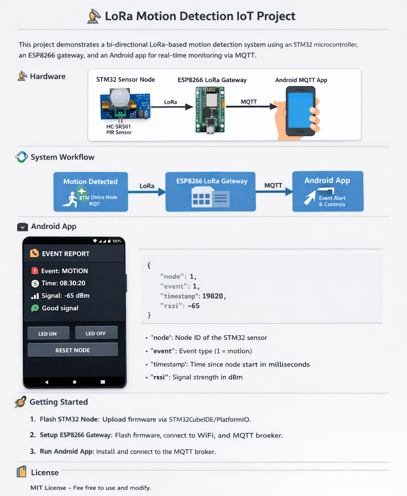

# 📡 Motion LoRa WiFi IoT System
A complete end-to-end IoT motion detection system using:
* 🟦 STM32 (Bluepill) + SX1278 LoRa (Remote Node)
* 🌐 ESP8266 LoRa Gateway
* ☁️ MQTT Cloud Communication
* 🐍 Python Desktop Monitor
* 📱 Android Mobile App

This project demonstrates a low-power long-range IoT architecture with real-time monitoring and remote command control.

---
## 1️⃣ 🏗️ System Architecture
<p align="center">  </p>

### Data Flow
```bash
Motion Sensor (PIR)
        │
        ▼
STM32 + SX1278 (LoRa TX)
        │
        ▼
ESP Gateway (LoRa RX)
        │
        ▼
MQTT Broker (Cloud)
        │
        ├─────────────► Python Desktop Client
        │
        └─────────────► Android App
```

---
## 2️⃣ 📂 Project Structure
```bash
project/
│
├── firmware/
│   ├── RemoteMotionNode/      # STM32 + SX1278 (CubeIDE)
│   └── GatewayNode/           # ESP8266 + SX1278 (VS Code-PlatformIO)
│
├── python/                    # MQTT Desktop Control Client
│
├── android/                   # Android MQTT Monitor App
│
├── docs/
│   └── images/
│
└── README.md
```
---
# 3️⃣ 🔧 Firmware Components
## 🟦 Remote Motion Node
* MCU: STM32F103C8T6 (Bluepill)
* LoRa Module: SX1278 (433 MHz)
* Sensor: PIR Motion Detector
* Interface: SPI (LoRa), GPIO (PIR)
* Toolchain: STM32CubeIDE

### Responsibilities
* Detect motion events
* Transmit LoRa packet
* Receive control commands
* Execute LED / Reset actions
* Operate in low-power mode

## 🌐 Gateway Node
* MCU: ESP8266
* LoRa Module: SX1278
* WiFi connectivity
* Toolchain: PlatformIO (VS Code)

### Responsibilities
* Receive LoRa packets
* Convert to JSON
* Publish to MQTT broker
* Receive MQTT commands
* Forward binary commands via LoRa
---
## 4️⃣ ☁️ MQTT Communication
| Parameter     | Value                                     |
|---------------|-------------------------------------------|
| Broker        | broker.hivemq.com                         |
| Port          | 1883                                      |
| Motion Topic  | `javierriv0826_esp8266_2026/lora/motion`  |
| Command Topic | `javierriv0826_esp8266_2026/lora/command` |

## 5️⃣ 📩 Motion Event Format (JSON)
```bash
{
  "node": 1,
  "event": 1,
  "timestamp": 1700000000,
  "rssi": -92
}
```

## 6️⃣ 🎮 Command Format (Binary)
```bash
[ NODE_ID | CMD_ID | VALUE ]
```

---
## 7️⃣ 🐍 Python Desktop Client
Features:
* Real-time motion monitoring
* Keyboard-based command sending
* MQTT v5 client
* Debug-friendly console output

Used for:
* Development
* Testing
* Diagnostics
---
## 8️⃣ 📱 Android Mobile App
📱 Android Mobile App
Built with:
* Kotlin
* Jetpack Compose
* Eclipse Paho MQTT

Features:
* Real-time motion display
* LED ON / OFF buttons
* RESET command
* Automatic reconnect

Designed as a lightweight monitoring interface.

---
## 9️⃣ 📦 Hardware Used
### Remote Node
* STM32F103C8T6 (Bluepill)
* SX1278 LoRa Module (433 MHz)
* PIR Motion Sensor
* 3.3V Power Supply
### Gateway Node
* ESP8266 / ESP32
* SX1278 LoRa Module
* WiFi Network

---
## ⚡ Key Technical Concepts Demonstrated
* LoRa half-duplex communication
* SPI peripheral configuration (STM32 & ESP)
* Interrupt-driven radio reception
* MQTT publish/subscribe model
* JSON serialization
* Binary command protocol
* Cross-platform IoT client integration
* Embedded low-power architecture

## 🔐 Security Considerations ⚠️
Current implementation uses:
* Public MQTT broker
* No TLS
* No authentication

For production:
* Enable TLS (MQTT over 8883)
* Use authentication
* Implement device authorization
* Add encryption at application layer

---

## 📄 License

This project is licensed under the **MIT License**.

You are free to use, modify, and distribute it.

---

## 👨‍💻 Author
**Javier Rivera**  
GitHub: *JavierRiv0826*