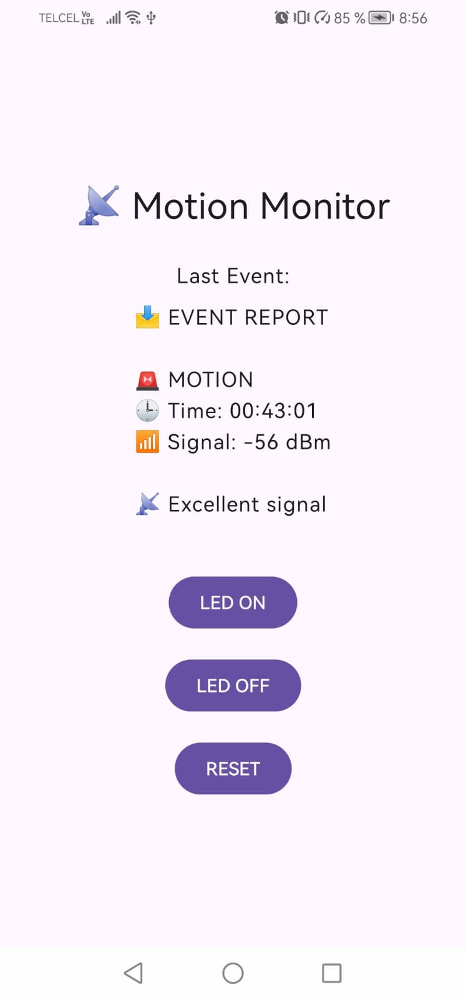

# 📱 Android – LoRa Motion Monitor App (Jetpack Compose)

This Android application connects to the MQTT broker used by the LoRa Motion IoT System, allowing:
* 📡 Real-time motion event monitoring
* 🎮 Remote control of the LoRa node
* 🔄 Automatic MQTT reconnection
* 📲 Simple and responsive UI built with Jetpack Compose

It acts as a mobile control and monitoring interface for the system.

---
## ✨ Features
* 🌐 MQTT real-time subscription
* { } JSON message reception
* Binary command transmission
* 🔗 Automatic reconnect
* Clean Compose-based UI
* Lightweight design for testing & monitoring

## 🌐 MQTT Configuration
| Parameter       | Value                                     |
|-----------------|-------------------------------------------|
| Broker          | `tcp://broker.hivemq.com:1883`            |
| Subscribe Topic | `javierriv0826_esp8266_2026/lora/motion`  |
| Command Topic   | `javierriv0826_esp8266_2026/lora/command` |
| Node ID         | `0x01`                                    |
| QoS             | 1                                         |

## 📩 Incoming Motion Payload
The Gateway publishes motion events in JSON format:
```bash
{
  "node": 1,
  "event": 1,
  "timestamp": 1700000000,
  "rssi": -92
}
```
The app receives the raw JSON string and displays the latest event on screen.

## 🎮 Command System
Commands are sent as 3-byte binary payloads:
```bash
[ NODE_ID | CMD_ID | VALUE ]
```
### Implemented Commands
| Button  | CMD ID | Value | Description  |
|---------|--------|-------|--------------|
| LED ON  | 0x10   | 0x01  | Turn LED ON  |
| LED OFF | 0x10   | 0x00  | Turn LED OFF |
| RESET   | 0x12   | 0x01  | Reset Node   |
Example payload (LED ON):
```bash
01 10 01
```

---
## 🧠 How It Works
### MainActivity
* Uses Jetpack Compose
* Maintains lastMessage state
* Connects to MQTT on launch using LaunchedEffect
* Updates UI automatically when new message arrives

### MqttManager

#### Handles:
* Broker connection
* Subscription to motion topic
* Command publishing
* Automatic reconnect
* Callback processing

#### Uses
* MqttAndroidClient
* MqttCallback
* IMqttActionListener

---
## 📚 Dependencies
```bash
implementation("org.eclipse.paho:org.eclipse.paho.client.mqttv3")
implementation("org.eclipse.paho:org.eclipse.paho.android.service")
```

## 🔐 Required Permissions
### Declared in AndroidManifest.xml:
```bash
<uses-permission android:name="android.permission.INTERNET" />
<uses-permission android:name="android.permission.WAKE_LOCK" />
<uses-permission android:name="android.permission.ACCESS_NETWORK_STATE" />
```
### MQTT background service:
```bash
<service
    android:name="org.eclipse.paho.android.service.MqttService"
    android:exported="false" />
``` 

---

## ▶️ How to Run

Clone the repository:
```bash
git clone https://github.com/JavierRiv0826/STM32-IoT-PIR-LoRa-WiFi-MQTT-Android.git
```
1. Open the project in Android Studio
2. Run the app on a physical Android device (Android 8.0+) or emulator.

When launched:
* App connects automatically to broker
* Subscribes to motion topic
* Displays latest received event
* Allows sending commands via buttons

---
## 🖥️ UI Overview

<p align="center">
  
  <br>
  <em>Android application receiving motion alerts via MQTT</em>
</p>

---
## ⚠️ Security Note
### Current configuration:
* Public MQTT broker
* No TLS
* No authentication
### For production:
* Use TLS (port 8883)
* Add credentials
* Use private broker
* Add certificate pinning

---

## 📄 License

This project is licensed under the **MIT License**.

You are free to use, modify, and distribute it.

---

## 👨‍💻 Author
**Javier Rivera**  
GitHub: *JavierRiv0826*